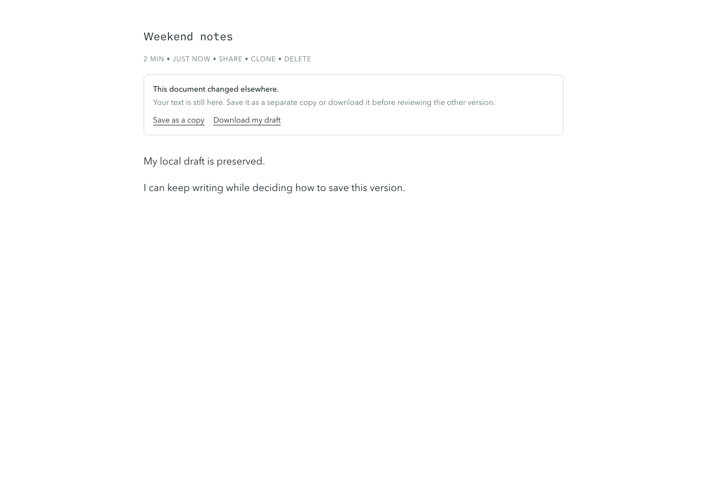

# Draft persistence

`DocumentDraftController` owns hydration, lazy CodeMirror text, scheduling and lifecycle snapshots. React subscribes to its small view state. The shared write coordinator serializes autosave and background flushes for the same owner/document/cache generation/authentication lifetime. Across browser tabs and devices, database updates still require the original `updated_at` value.

Only versions confirmed by this coordinator can advance queued local drafts. Legacy drafts marked with an untrusted base version remain read-only at the persistence boundary until the same body is confirmed remotely; controller edits and sharing updates preserve that marker. A delayed older background snapshot is skipped. Conflicts preserve the local version, stop automatic writes, and offer **Save as a copy** (the existing media-aware clone flow) and **Download my draft**. A conflict never advances the content's concurrency timestamp, including after sharing changes.

Cache writes are best-effort. A rejected clean-cache confirmation can be retried without repeating the network update. An editor that mounts while IndexedDB is unavailable can adopt the first recovered cache generation; it cannot cross a later revocation. Explicit sign-out retires the write session immediately.

## Verification

- `npm run test -- --maxWorkers=2`: database-client mocks with real fake-indexeddb transactions exercise overlapping background/foreground writes and revoked generations. Controller tests cover conflicting hydration, lazy serialization and retry/lifecycle behavior. Mounted React tests cover StrictMode, immediate exit, cache recovery and conflict actions.
- `npm run lint && npm run typecheck && npm run build`.
- Manual integration on a local Supabase stack: open the same document in two tabs, save different text in the first tab, then edit the second. The second must retain its text and show the conflict notice. Download the current draft or save a copy and confirm the original remote version remains unchanged.
- Exercise offline editing, reconnecting, leaving before the debounce, and enabling sharing during edits. Confirm the latest local text survives and clean-cache state follows a successful save.

No production data or credentials are needed for the automated checks. Live Supabase integration remains a manual check.

## Visual proof



Captured at 1280×900 from a temporary local `/auth/refactor-proof` page rendering the real `DraftSyncNotice` with `status="conflict"`, `isCloning={false}`, `isDeleting={false}`, the title “Weekend notes”, and a preserved local draft. The fixture route was removed afterward. To reproduce the image, render the component in the same local fixture and run:

```sh
npx --yes --package=playwright playwright screenshot --wait-for-selector '[role=alert]' --full-page --viewport-size '1280,900' http://localhost:3113/auth/refactor-proof docs/screenshots/draft-conflict.png
```
